# VigilAI - Database Entity-Relationship (ER) Diagram

This document contains the Entity-Relationship diagram for the **VigilAI** PostgreSQL backend database. 
It defines the 11 tables, their field attributes, keys, and relational cardinality structures.

---

## 📊 Interactive Mermaid ER Schema

This diagram is rendered interactively using Markdown-compatible **Mermaid.js** syntax. 

```mermaid
erDiagram
    users {
        int id PK
        string full_name "VARCHAR(150)"
        string email "VARCHAR(150) UNIQUE"
        string password_hash "VARCHAR(255)"
        string role "VARCHAR(50)"
        string phone_number "VARCHAR(30) NULL"
        boolean is_active "DEFAULT TRUE"
        timestamp_tz created_at "DEFAULT CURRENT_TIMESTAMP"
        timestamp_tz updated_at "DEFAULT CURRENT_TIMESTAMP"
    }

    cameras {
        int id PK
        string camera_name "VARCHAR(100)"
        string camera_type "VARCHAR(50)"
        string stream_url "VARCHAR(255)"
        string location "VARCHAR(150) NULL"
        string status "VARCHAR(30)"
        string resolution "VARCHAR(30)"
        int fps "DEFAULT 30"
        timestamp_tz created_at "DEFAULT CURRENT_TIMESTAMP"
    }

    live_streams {
        int id PK
        int camera_id FK "ON DELETE CASCADE"
        string stream_status "VARCHAR(30)"
        timestamp_tz started_at "DEFAULT CURRENT_TIMESTAMP"
        timestamp_tz ended_at "NULL"
        int bitrate "NULL"
    }

    detections {
        int id PK
        int camera_id FK "ON DELETE CASCADE"
        string detection_type "VARCHAR(50) (Index)"
        double confidence_score "DOUBLE PRECISION"
        timestamp_tz detected_at "DEFAULT CURRENT_TIMESTAMP (Index)"
        jsonb bounding_box "JSONB"
        jsonb pose_data "JSONB"
        string snapshot_url "VARCHAR(255) NULL"
        string video_clip_url "VARCHAR(255) NULL"
    }

    alerts {
        int id PK
        int detection_id FK "ON DELETE CASCADE"
        string alert_type "VARCHAR(50) (Index)"
        text alert_message "TEXT"
        string delivery_method "VARCHAR(50)"
        string delivery_status "VARCHAR(30) DEFAULT 'pending'"
        timestamp_tz sent_at "DEFAULT CURRENT_TIMESTAMP (Index)"
    }

    recordings {
        int id PK
        int camera_id FK "ON DELETE CASCADE"
        string file_path "VARCHAR(255)"
        double duration "DOUBLE PRECISION"
        timestamp_tz recording_date "DEFAULT CURRENT_TIMESTAMP"
        string storage_type "VARCHAR(50) DEFAULT 'local'"
    }

    snapshots {
        int id PK
        int detection_id FK "ON DELETE CASCADE"
        string image_path "VARCHAR(255)"
        boolean face_blurred "DEFAULT FALSE"
        timestamp_tz created_at "DEFAULT CURRENT_TIMESTAMP"
    }

    analytics {
        int id PK
        int total_alerts "INTEGER DEFAULT 0"
        int total_detections "INTEGER DEFAULT 0"
        int fall_count "INTEGER DEFAULT 0"
        int fight_count "INTEGER DEFAULT 0"
        int weapon_count "INTEGER DEFAULT 0"
        int loitering_count "INTEGER DEFAULT 0"
        timestamp_tz generated_at "DEFAULT CURRENT_TIMESTAMP"
    }

    devices {
        int id PK
        string device_name "VARCHAR(100)"
        string device_type "VARCHAR(50)"
        string ip_address "VARCHAR(45)"
        string mac_address "VARCHAR(17)"
        string status "VARCHAR(30)"
        timestamp_tz last_connected "NULL"
    }

    privacy_settings {
        int id PK
        int user_id FK "UNIQUE, ON DELETE CASCADE"
        boolean face_blur_enabled "DEFAULT TRUE"
        boolean local_storage_only "DEFAULT FALSE"
        boolean cloud_backup_enabled "DEFAULT FALSE"
        int data_retention_days "DEFAULT 30"
    }

    audit_logs {
        int id PK
        int user_id FK "ON DELETE SET NULL"
        string action "VARCHAR(100)"
        text description "TEXT NULL"
        string ip_address "VARCHAR(45) NULL"
        timestamp_tz created_at "DEFAULT CURRENT_TIMESTAMP"
    }

    %% Relationship Rules
    users ||--|| privacy_settings : "has configuration"
    users ||--o{ audit_logs : "triggers"
    cameras ||--o{ live_streams : "broadcasts"
    cameras ||--o{ detections : "records"
    cameras ||--o{ recordings : "saves historical"
    detections ||--o{ alerts : "raises"
    detections ||--o{ snapshots : "produces"
```

---

## 🔗 Schema Relationship Matrix

| Relationship | Type | Cascading Behavior | Operational Context |
| :--- | :--- | :--- | :--- |
| `users` ➔ `privacy_settings` | **1 : 1** | `ON DELETE CASCADE` | Standard user preference lookup on frame blur actions. |
| `users` ➔ `audit_logs` | **1 : N** | `ON DELETE SET NULL` | Audit logs persist even if admin/operator account is deleted. |
| `cameras` ➔ `live_streams` | **1 : N** | `ON DELETE CASCADE` | Removing a camera automatically flushes stream session state tables. |
| `cameras` ➔ `detections` | **1 : N** | `ON DELETE CASCADE` | Deleting a camera removes historical detection event markers. |
| `cameras` ➔ `recordings` | **1 : N** | `ON DELETE CASCADE` | Video recordings catalog mapping cleans up on camera drop. |
| `detections` ➔ `alerts` | **1 : N** | `ON DELETE CASCADE` | Alerts map back to the unique ML triggering frame detection record. |
| `detections` ➔ `snapshots` | **1 : N** | `ON DELETE CASCADE` | Multi-frame snapshot files link back to the parent detection node. |

---

## 🎯 Index Optimization & Performance Strategies

To support **real-time sub-second queries** when compiling dashboards and running alert timelines:

1. **`users(email)`**: B-Tree index for immediate authentication hashes.
2. **`detections(detection_type)`**: Hash index supporting rapid filters (e.g., retrieving only "Fall" detections).
3. **`detections(detected_at)`**: Descending B-Tree index optimized for fetching the most recent events first (Timeline feeds).
4. **`alerts(alert_type)`**: Index for quick reporting on notifications.
5. **`privacy_settings(user_id)`**: Hash index supporting user preference masking checks on live feed captures.
6. **`audit_logs(created_at)`**: Ordering index for chronological event list fetches.
